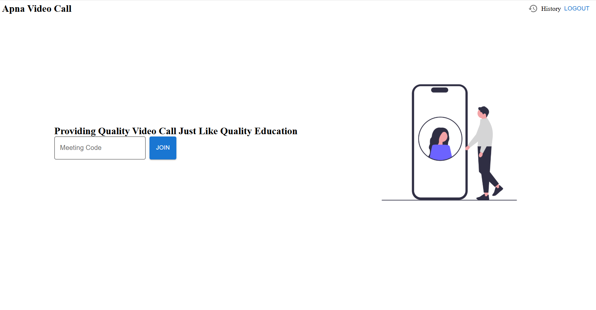
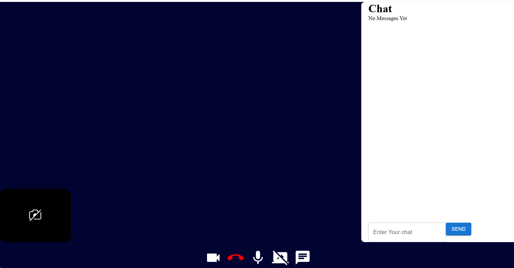
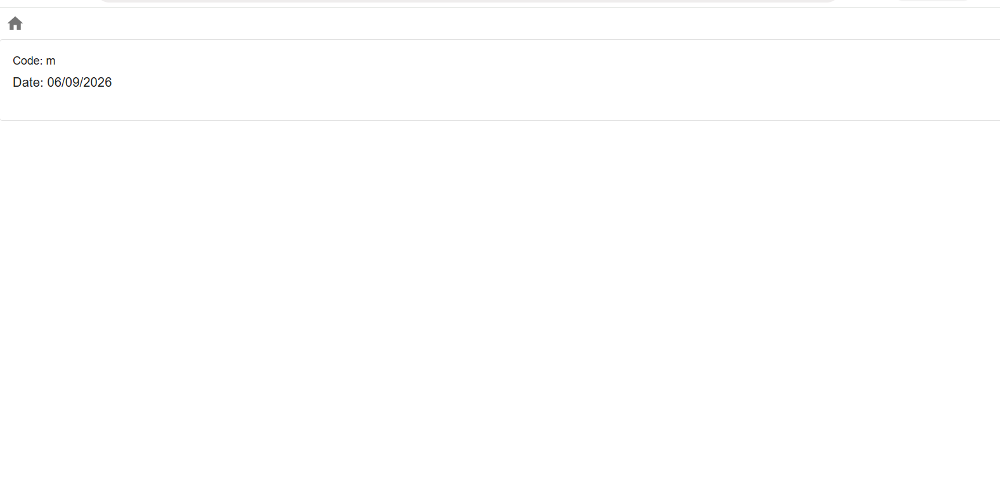

# 🎥 ApnaVideoCall

ApnaVideoCall is a full-stack real-time video calling web application built with React.js, Node.js, Express.js, MongoDB, WebRTC, and Socket.IO.

It allows users to create/join meeting rooms, communicate through video and audio, share their screen, chat in real time, and maintain a history of previous meetings.

## 🌐 Live Demo

👉 https://apnavideozoomfrontend.onrender.com

    The project is deployed using Render.

    Note: Render free-tier services can take some time to wake up after inactivity.

---

## ✨ Features

- 🎥 Real-time video calling
- 🎙️ Audio and video controls
- 👥 Multi-user meeting rooms
- 🖥️ Screen sharing
- 💬 Real-time chat
- 🔐 User registration and login
- 🔑 Token-based authentication
- 🛡️ Protected routes
- 📜 Meeting history
- 🚪 Join meetings using a meeting code
- 📱 Responsive user interface
- ⚡ Real-time communication using Socket.IO
- 🔗 Peer-to-peer media communication using WebRTC

---

## 🛠️ Tech Stack

### Frontend
- React.js
- React Router
- Material UI (MUI)
- Axios
- Socket.IO Client
- WebRTC

### Backend
- Node.js
- Express.js
- MongoDB
- Mongoose
- Socket.IO
- bcrypt
- CORS

## 🎥 Video Meeting

The application uses **WebRTC** for real-time peer-to-peer audio and video communication.

Users can:

- Turn camera on/off
- Mute/unmute microphone
- Share their screen
- Join multi-user meeting rooms
- Leave/end a meeting

A Google STUN server is used to help establish peer-to-peer connections.

---

## 💬 Real-Time Chat

Socket.IO is used for real-time communication between users inside a meeting room.

Users can:

- Send messages during meetings
- Receive messages instantly
- See unread message notifications
- Chat with all participants in the meeting room

---

## 🔐 Authentication

ApnaVideoCall provides user authentication using a custom backend authentication system.

### Registration
Users register using:

- Name
- Username
- Password

Passwords are securely hashed using **bcrypt** before being stored in MongoDB.

### Login

After successful login, the backend generates an authentication token.

The token is stored in the browser's `localStorage` and is used for authenticated operations.

Protected pages redirect unauthenticated users to the authentication page.

---

## 📜 Meeting History

Authenticated users can view their previous meetings.

For every meeting, the application stores:

- Meeting code
- User
- Meeting date

The history page displays the previous meeting codes along with their dates.

---

## 🗄️ Database Models

### User

Stores registered user information.

```text
User
├── name
├── username
├── password
└── token
```

### Meeting

Stores meeting activity.

```text
Meeting
├── user_id
├── meetingCode
└── date
```

---

## 🔌 API Endpoints

Base URL:

```text
/api/v1/users
```

| Method | Endpoint | Description |
|---|---|---|
| POST | `/login` | Login user |
| POST | `/register` | Register new user |
| POST | `/add_to_activity` | Add meeting to history |
| GET | `/get_all_activity` | Get user's meeting history |

---

## 🔄 Application Flow

```text
                ┌──────────────────┐
                │   Landing Page   │
                └────────┬─────────┘
                         │
              ┌──────────┴──────────┐
              │                     │
          Register                Login
              │                     │
              └──────────┬──────────┘
                         │
                         ▼
                ┌──────────────────┐
                │   Home Page      │
                └────────┬─────────┘
                         │
                  Enter Meeting Code
                         │
                         ▼
                ┌──────────────────┐
                │  Meeting Room    │
                └────────┬─────────┘
                         │
             ┌───────────┼───────────┐
             │           │           │
             ▼           ▼           ▼
          WebRTC      Socket.IO    Chat
         Video/Audio   Signaling   Messages
```

---

## 📁 Project Structure

```text
ApnaVideoCall/
│
├── backend/
│   ├── src/
│   │   ├── app.js
│   │   ├── controllers/
│   │   │   ├── socketManager.js
│   │   │   └── user.controller.js
│   │   ├── models/
│   │   │   ├── user.model.js
│   │   │   └── meeting.model.js
│   │   └── routes/
│   │       └── users.routes.js
│   │
│   └── package.json
│
├── frontend/
│   ├── src/
│   │   ├── App.js
│   │   ├── contexts/
│   │   │   └── AuthContext.js
│   │   ├── pages/
│   │   │   ├── landing/
│   │   │   ├── authentication/
│   │   │   ├── home/
│   │   │   ├── history/
│   │   │   └── VideoMeet/
│   │   └── components/
│   │
│   └── package.json
│
└── README.md
```

> Folder/file names may vary slightly depending on your final project structure.

---

## 🚀 Getting Started

### 1. Clone the repository

```bash
git clone <your-github-repository-url>
cd ApnaVideoCall
```

### 2. Install backend dependencies

```bash
cd backend
npm install
```

### 3. Configure environment variables

Create a `.env` file inside the backend folder.

```env
MONGO_URI=your_mongodb_connection_string
PORT=8000
```

Use your own MongoDB connection string.

**Do not commit database credentials or secrets to GitHub.**

### 4. Start the backend

```bash
npm run dev
```

The backend runs on:

```text
http://localhost:8000
```

### 5. Install frontend dependencies

Open another terminal:

```bash
cd frontend
npm install
```

### 6. Start the frontend

```bash
npm start
```

The frontend will run on:

```text
http://localhost:3000
```

---

## 🌐 Application Routes

| Route | Description |
|---|---|
| `/` | Landing page |
| `/auth` | Login / Registration |
| `/home` | User dashboard |
| `/history` | Meeting history |
| `/:url` | Video meeting room |

---

## 🔄 Real-Time Communication

Socket.IO handles:

- Joining meeting rooms
- User joining notifications
- User leaving notifications
- WebRTC signaling
- Real-time chat messages

WebRTC handles:

- Camera streams
- Microphone streams
- Screen sharing
- Peer-to-peer media connections

---

## 📸 Screenshots

Add your screenshots inside the `screenshots` folder and use the following:

### Home Page

.png)

### Login

.png)

### Meeting-Code



### Real-Time Chat



### Meeting History



## ⭐ Support

If you like this project, consider giving the repository a ⭐ on GitHub.
